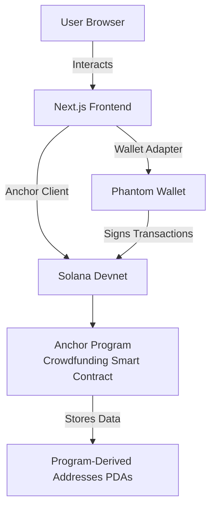
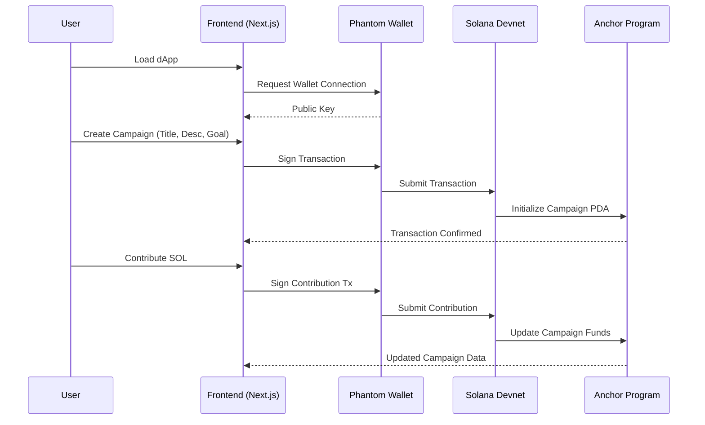

# 🚀 Solana Crowdfunding dApp

<div align="center">
  


**A decentralized crowdfunding platform built on the Solana blockchain**

[Features](#features) • 
[Tech Stack](#tech-stack) • 
[Architecture](#architecture) • 
[Installation](#getting-started) • 
[Usage](#usage) • 
[Roadmap](#planned-enhancements)

</div>

## 📋 Overview

This dApp enables users to create and fund campaigns securely and transparently on the Solana blockchain. It leverages Next.js, Anchor, Tailwind CSS, and Phantom Wallet to deliver a seamless Web3 experience. Inspired by Daltonic/fundus, this platform has been customized with significant UI enhancements to align with modern design standards.

## ✨ Features

- **Create Campaigns** — Launch crowdfunding campaigns with title, description, and funding goal
- **Contribute Funds** — Support campaigns by contributing SOL using Phantom Wallet
- **View Campaign Details** — Track campaign progress with real-time updates on funds raised
- **Decentralized & Secure** — Built on Solana for fast, low-cost transactions with trustless execution

## 🛠️ Tech Stack

| Category | Technologies |
|----------|--------------|
| **Frontend** | Next.js, React, Tailwind CSS |
| **Smart Contracts** | Anchor (Rust) |
| **Wallet Integration** | Phantom Wallet via Solana Wallet Adapter |
| **Network** | Solana Devnet |

## 🏗️ Architecture

### High-Level Architecture

The dApp follows a client-serverless architecture, with the frontend interacting directly with Solana smart contracts via Anchor's client library.



### Component Interaction

This diagram illustrates how frontend components communicate with the Solana program:



## 🚀 Getting Started

### Prerequisites

| Requirement | Version |
|-------------|---------|
| Node.js | v18.18.0 or higher |
| Rust | v1.77.2 or higher |
| Anchor CLI | v0.30.1 or higher |
| Solana CLI | v1.18.17 or higher |
| Phantom Wallet | Browser extension |
| pnpm | v8.0.0 or higher |

### Installation

#### 1. Clone the Repository

```bash
git clone https://github.com/YourUsername/solana-crowdfunding.git
cd solana-crowdfunding
```

#### 2. Install Dependencies

```bash
pnpm install
```

#### 3. Set Up Solana Devnet

```bash
solana config set --url https://api.devnet.solana.com
solana-keygen new
solana airdrop 2
```

### Anchor Program Setup

The Solana smart contract is located in the `anchor` directory.

#### 1. Navigate to Anchor Directory

```bash
cd anchor
```

#### 2. Sync Program ID
Updates the program ID in Anchor.toml, lib.rs, and basic-exports.ts.

```bash
pnpm anchor keys sync
```

#### 3. Build the Program

```bash
pnpm anchor-build
```

#### 4. Deploy to Devnet

```bash
pnpm anchor deploy --provider.cluster devnet
```

#### 5. Run Tests (Optional)

```bash
pnpm anchor-test
```

#### 6. Start Local Validator (Optional)

```bash
pnpm anchor-localnet
```

### Web App Setup

The frontend is located in the `web` directory.

#### 1. Navigate to Web Directory

```bash
cd ../web
```

#### 2. Update Program ID
Ensure the program ID in `web/src/constants.js` (or similar) matches the one generated during `anchor keys sync`.

#### 3. Start the Web App

```bash
pnpm dev
```

#### 4. Access the dApp
Open http://localhost:3000 in a browser with Phantom Wallet installed.

#### 5. Build for Production

```bash
pnpm build
```

## 💻 Usage

1. **Connect your Phantom Wallet** (set to Devnet)
2. **Create a campaign** by entering a title, description, and funding goal
3. **Contribute SOL** to existing campaigns
4. **View campaign details** and progress

## 🔮 Planned Enhancements

| Feature | Description |
|---------|-------------|
| **UI Redesign** | Modernize interface with custom color scheme, responsive layouts using Shadcn/UI or Material-UI |
| **Campaign Listing** | Add paginated list of all active campaigns with filtering options |
| **Withdraw Funds** | Implement functionality for campaign creators to withdraw raised funds |
| **Analytics Dashboard** | Display funding trends and detailed contribution metrics |
| **Social Sharing** | Add capability to share campaigns on social platforms |

## 🌐 Project Structure

```
solana-crowdfunding/
├── anchor/              # Smart contract code (Rust)
│   ├── programs/        # Main program logic
│   ├── tests/           # Contract tests
│   └── Anchor.toml      # Configuration file
├── web/                 # Frontend application (Next.js)
│   ├── public/          # Static assets
│   ├── src/             
│   │   ├── components/  # React components
│   │   ├── contexts/    # React contexts
│   │   ├── pages/       # Next.js pages
│   │   └── utils/       # Helper functions
│   └── next.config.js   # Next.js configuration
└── README.md            # Project documentation
```

## 👏 Acknowledgments

This project is inspired by [Daltonic/fundus](https://github.com/Daltonic/fundus). The original codebase provided a foundation, which has been extensively customized and enhanced to create a modern crowdfunding platform with improved user experience and additional features.

## 📄 License

MIT License - Based on the original repository's license, with modifications to reflect additional contributions.

---

<div align="center">
  <sub>Built with ❤️ on Solana</sub>
</div>